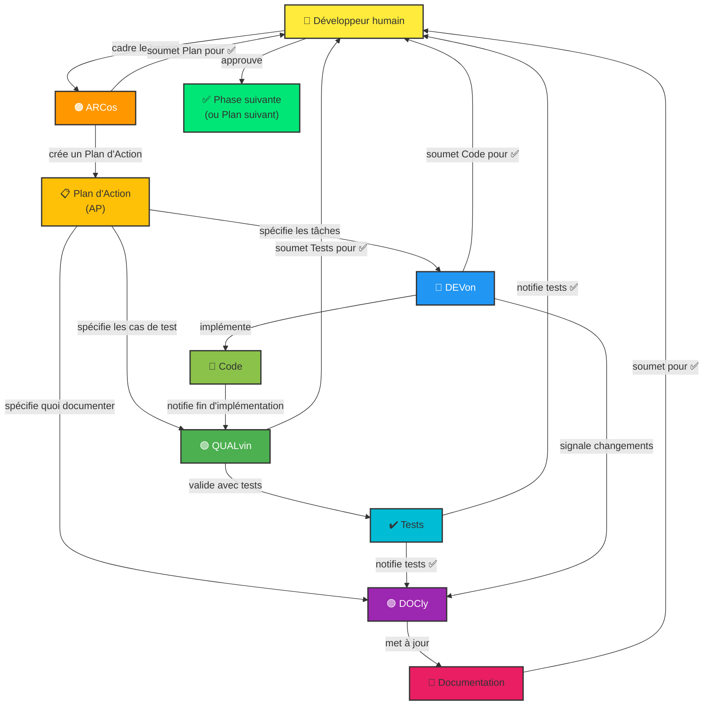

# Instructions Copilot — Dépôt Transverse vzwingma

> Ce fichier décrit le **dépôt transverse de templates Copilot multi-agents** (`vzwingma/vzwingma`).
> Il sert d'infrastructure réutilisable pour orchestrer le développement dans n'importe quel projet.

## 👋 Bienvenue ! Agents Copilot et Relations

Ce dépôt utilise une **architecture multi-agents** orchestrée pour coordonner les évolutions des templates, agents et skills via des **Plans d'Action (AP)** structurés.

### 🤖 Les Agents et leurs Rôles

Quatre agents spécialisés travaillent ensemble, orchestrés par un **👤 Développeur humain** :

#### **🟠 ARCos** [v2.6]
- **Rôle :** Planificateur et orchestrateur technique
- **Responsabilités :**
  - Concevoir des solutions architecturales complètes
  - Créer et valider les Plans d'Action multi-phases
  - Décomposer les initiatives en tâches logiques
  - Orchestrer le travail entre Devon, Qalvin et Docly
  - Lire `.github/instructions/architect.instructions.md` au démarrage pour les spécificités du projet
  - Lire `docs/ARCHITECTURE.md` au démarrage pour comprendre le contexte architectural du projet
- **Quand l'utiliser :** "Conçois une architecture pour...", "Crée un plan pour...", "Découpe ça en tâches"
- **Livrable :** Plans d'Action détaillés avec phases, tâches et dépendances

#### **🔵 DEVon** [v2.3]
- **Rôle :** Implémentateur de code de production
- **Responsabilités :**
  - Traduire les exigences en code fonctionnel et testé
  - Respecter les patterns architecturaux et conventions du projet
  - Mettre à jour les dépendances et refactoriser le code
  - Implémenter les optimisations de performance
  - Lire `.github/instructions/dev.instructions.md` au démarrage pour les spécificités du projet
- **Quand l'utiliser :** "Implémente cette fonctionnalité", "Développe selon l'architecture", "Code cette fonction"
- **Livrable :** Code propre, compilant et compilant sans erreurs

#### **🟢 QUALvin** [v2.5]
- **Rôle :** Expert en assurance qualité et tests
- **Responsabilités :**
  - Écrire des tests unitaires complets (composants, services, modèles)
  - Assurer une couverture de test ≥80%
  - Tester les cas limites et les scénarios d'erreur
  - Valider que le code fonctionne correctement
  - Lire `.github/instructions/qa.instructions.md` au démarrage pour les spécificités du projet
- **Quand l'utiliser :** "Écris des tests pour ce composant", "Génère des tests unitaires", "Valide avec des tests"
- **Livrable :** Tests passants avec rapports de couverture

#### **🟣 DOCly** [v2.4]
- **Rôle :** Gardien de la documentation
- **Responsabilités :**
  - Mettre à jour README, `docs/` et guides
  - Maintenir `docs/ARCHITECTURE.md` à jour avec l'état réel du projet
  - Créer les ADRs dans `docs/adr/` sur délégation d'ARCos
  - Documenter les changements architecturaux
  - Mettre à jour les instructions Copilot quand les agents changent
  - Garder la documentation en sync avec le code
  - Lire `.github/instructions/doc.instructions.md` au démarrage pour les spécificités du projet
- **Quand l'utiliser :** "Mets à jour la documentation", "Garde les docs en sync avec ce code", "Ajoute ça au README"
- **Livrable :** Documentation à jour, claire et complète

---

### 🔄 Workflow Typique

1. **Cadrage (👤 Développeur humain)** → Définir le besoin et les critères d'acceptation
2. **Planification (🟠 ARC - Arcos)** → Créer un Plan d'Action avec phases et tâches
3. **Validation Humaine** → Approuver le plan avant de lancer
4. **Implémentation (🔵 DEV - Devon)** → Coder les tâches assignées
5. **Validation Humaine** → Approuver le code avant tests
6. **Tests (🟢 QUAL - Qalvin)** → Écrire et valider les tests
7. **Validation Humaine** → Approuver les tests avant doc
8. **Documentation (🟣 DOC - Docly)** → Mettre à jour la documentation
9. **Validation Humaine** → Approuver la documentation
10. **Phase Suivante** → Lancer la phase suivante du plan (étape 2)

> 💡 **Parallélisation** : Les étapes 4→6 (DEVon) et 6→8 (QUALvin + DOCly) peuvent être parallélisées avec `/fleet` quand les tâches sont indépendantes.

---

## 📋 Plans d'Action et Suivi

Chaque initiative majeure (modernisation, nouvelle feature, refactoring) est orchestrée via un **Plan d'Action (AP)** :

- **Fichier plan :** `.github/plans/<NO>_<nom>.plan.md`
- **Rapports de phase :** `.github/plans/<NO>_reports/PHASE_N_...md`
- **Index des plans :** `.github/plans/README.md`
- **Guide complet :** `.github/PLANS.md`

Les Plans d'Action coordonnent le travail multi-phases et garantissent une traçabilité complète via les rapports.

## 📐 Instructions Spécifiques Projet (`.github/instructions/`)

Chaque agent lit au démarrage son fichier d'instructions spécifique au projet :

| Fichier | Agent | Contenu |
|---|---|---|
| `architect.instructions.md` | 🟠 ARCos | Conventions archi, couches, protocole SQL handoff |
| `dev.instructions.md` | 🔵 DEVon | Stack technique, versions, conventions de code |
| `qa.instructions.md` | 🟢 QUALvin | Framework de test, commandes CI, cas à couvrir |
| `doc.instructions.md` | 🟣 DOCly | Fichiers /docs, conventions de documentation |

Dans ce dépôt transverse, ces fichiers sont des **templates** (avec placeholders `[...]`) destinés à être copiés et personnalisés dans chaque projet cible.

> Pour initialiser ces fichiers : utiliser le prompt `init-copilot-instructions`.  
> Pour les mettre à jour : utiliser le prompt `update-copilot-instructions`.

## 🛠️ Skills Partagés (`.github/skills/`)

Les skills sont des procédures réutilisables incluses automatiquement dans le contexte de tous les agents (`applyTo: **`) :

| Skill | Emplacement | Contenu |
|---|---|---|
| `plan-phase-execution` | `.github/skills/plan-phase-execution/SKILL.md` | Procédure standard d'exécution de phase AP (avant/pendant/après, formats de rapport) |
| `plan-creation` | `.github/skills/plan-creation/SKILL.md` | Procédure de création et d'orchestration d'un Plan d'Action (ARCos + agents orchestrateurs) |
| `fleet-guide` | `.github/skills/fleet-guide/SKILL.md` | Guide de parallélisation `/fleet` (quand utiliser, règle de décision) |

Ces skills centralisent les procédures communes pour éviter la duplication entre agents.

---

## 🏗️ Présentation du Projet

Ce dépôt est le **dépôt transverse de templates Copilot multi-agents** pour l'organisation `vzwingma`. Il ne contient pas de code applicatif mais des **artefacts d'infrastructure Copilot** réutilisables :

- **Agents génériques** (`.github/agents/`) : ARCos, DEVon, QUALvin, DOCly
- **Skills partagés** (`.github/skills/`) : procédures AP et /fleet communes
- **Templates d'instructions** (`.github/instructions/`) : à personnaliser par projet
- **Prompts** (`.github/prompts/`) : initialisation et mise à jour des instructions
- **Guide Plans d'Action** (`.github/PLANS.md`) : référence pour orchestrer le travail multi-phases
- **Documentation** (`docs/`, `QUICK_START.md`, `SETUP_CHECKLIST.md`) : guides d'utilisation

**Usage :** Copier les fichiers de ce dépôt vers un projet cible, puis utiliser `init-copilot-instructions` pour personnaliser.

---

## 📁 Architecture du Dépôt

```
vzwingma/
├── .github/
│   ├── agents/                          # Agents génériques (transverses — ne pas modifier par projet)
│   │   ├── Arcos.agent.md               # Architecte & orchestrateur (v2.6)
│   │   ├── Devon.agent.md               # Développeur (v2.3)
│   │   ├── Qalvin.agent.md              # QA & tests (v2.5)
│   │   └── Docly.agent.md               # Documentation (v2.4)
│   ├── skills/                          # Procédures partagées (applyTo: **)
│   │   ├── plan-phase-execution/
│   │   │   └── SKILL.md
│   │   ├── plan-creation/
│   │   │   └── SKILL.md
│   │   └── fleet-guide/
│   │       └── SKILL.md
│   ├── instructions/                    # Templates à personnaliser par projet
│   │   ├── architect.instructions.md
│   │   ├── dev.instructions.md
│   │   ├── qa.instructions.md
│   │   └── doc.instructions.md
│   ├── prompts/                         # Prompts réutilisables
│   │   ├── init-copilot-instructions.prompt.md
│   │   ├── update-copilot-instructions.prompt.md
│   │   └── migrate-to-template.prompt.md
│   ├── plans/                           # Plans d'Action de ce dépôt transverse
│   │   └── README.md
│   ├── PLANS.md                         # Guide centralisé Plans d'Action
│   ├── copilot-instructions.md          # Ce fichier (instructions pour ce repo)
│   └── copilot-instructions.template.md # Template vierge à copier dans les projets
├── docs/
│   ├── ARCHITECTURE.md                  # Architecture de ce dépôt transverse
│   ├── ARCHITECTURE.template.md         # Template architecture à copier dans les projets
│   └── adr/                             # Décisions architecturales
├── QUICK_START.md                       # Guide rapide d'utilisation
├── SETUP_CHECKLIST.md                   # Checklist d'initialisation projet
└── README.md                            # Présentation du dépôt
```

---

## ⚙️ Conventions Clés

### Nommage des fichiers

| Type | Convention | Exemple |
|---|---|---|
| Agent | `*.agent.md` | `Arcos.agent.md` |
| Skill | `<skill>/SKILL.md` | `plan-phase-execution/SKILL.md` |
| Instructions projet | `*.instructions.md` | `dev.instructions.md` |
| Prompt | `*.prompt.md` | `init-copilot-instructions.prompt.md` |
| Plan d'Action | `NNN_<nom>.plan.md` | `001_modernisation.plan.md` |
| Rapport de phase | `PHASE_N_COMPLETION_REPORT.md` | — |

### Frontmatter des fichiers `.md` Copilot

- **Agents** (`.github/agents/`) : `description`, `name`, optionnel `agents: ["*"]`
- **Skills** (`.github/skills/`) : `description`, `applyTo: "**"` (inclusion automatique)
- **Instructions** (`.github/instructions/`) : `description`, `applyTo: "**"`

### Versioning des agents

Chaque agent porte un numéro de version dans son `description` (ex: `[v2.5]`).
Incrémenter la version à chaque modification du contenu de l'agent.

### Langue

- Documentation : **français**
- Blocs de code et exemples techniques : **anglais**
- Placeholders templates : `[NOM_EN_MAJUSCULES]`

---

## 🔄 Maintenance du Dépôt Transverse

- **Modifier un agent** → incrémenter sa version, mettre à jour le changelog dans le versioning block, mettre à jour les versions dans `copilot-instructions.md` et `copilot-instructions.template.md`
- **Modifier un skill** → vérifier la cohérence avec `PLANS.md`, signaler dans les agents qui y référencent
- **Ajouter un fichier template** → documenter dans `QUICK_START.md`, `SETUP_CHECKLIST.md` et `init-copilot-instructions.prompt.md`
- **Pas de commandes de build/test** : ce dépôt est documentation-only

---

## 📊 Relations entre Agents (Diagramme Mermaid)



