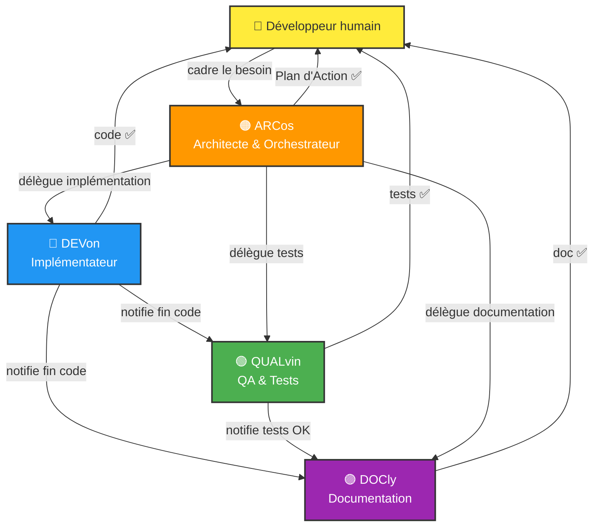

# 🤖 Copilot Templates & Agents Repository

Ce dépôt est un **centre de référence transverse** pour les modèles réutilisables, les instructions et les prompts Copilot. Il permet de coordonner le développement avec une **architecture multi-agents orchestrée**.

## 📚 Contenus

### 🤖 Agents Copilot (.github/agents/)

Quatre agents spécialisés pour orchestrer le développement :

- **Arcos.agent.md** — Planificateur technique et orchestrateur (🟠 ARCos)
- **Devon.agent.md** — Implémentateur de code de production (🔵 DEVon)
- **Qalvin.agent.md** — Expert QA et tests unitaires (🟢 QUALvin)
- **Docly.agent.md** — Documentation Agent (🟣 DOCly)

Tous les agents sont **génériques et prêts à l'emploi** dans n'importe quel projet.

### 📋 Templates (.github/)

- **copilot-instructions.template.md** — Template générique pour initialiser les instructions Copilot dans un nouveau projet (avec placeholders)
- **copilot-instructions.md** — Copie du template (version de base générique)
- **instructions/** — 4 templates d'instructions spécifiques au projet (architect, dev, qa, doc) avec placeholders à remplir
- **PLANS.md** — Guide complet pour créer et exécuter les Plans d'Action multi-phases

### 🎯 Prompts (.github/prompts/)

Prompts réutilisables pour des tâches récurrentes :

- **init-copilot-instructions.prompt.md** — Initialiser les instructions Copilot dans un nouveau projet
- **update-copilot-instructions.prompt.md** — Auditer et mettre à jour les instructions depuis le code source
- **migrate-to-template.prompt.md** — Migrer un projet existant vers ces templates

### 📖 Exemples (.github/examples/)

Exemples concrets pour différents types de projets :

- **copilot-instructions-domoticz.example.md** — Exemple : projet React Native / Expo (archivé à titre de référence)

### 📖 Documentation

- **.github/README.md** — Guide d'utilisation des templates, agents et prompts

---

## 🚀 Quick Start : Initialiser un Nouveau Projet

### 1. Copier le template

```bash
cp .github/copilot-instructions.template.md <votre_projet>/.github/copilot-instructions.md
cp -r .github/instructions <votre_projet>/.github/
```

### 2. Initialiser automatiquement

Utiliser le prompt init-copilot-instructions pour générer les instructions :

```
👤 "Initialise les instructions Copilot pour ce projet"
```

Le prompt va analyser votre code et remplir les sections automatiquement.

### 3. Valider

Vérifier que tous les placeholders sont remplacés et que les conventions du projet sont bien documentées.

---

## 🎯 Workflow Typique



Pour en savoir plus, consulter `.github/PLANS.md`.

> 💡 **Parallélisation** : Utiliser `/fleet` quand plusieurs tâches (DEVon, QUALvin, DOCly) sont indépendantes pour les exécuter simultanément.

---

## 📚 Documentation

- **.github/README.md** — Guide complet d'utilisation
- **.github/PLANS.md** — Guide pour les Plans d'Action
- **.github/agents/*.md** — Instructions pour chaque agent
- **.github/instructions/*.md** — Instructions spécifiques projet pour chaque agent
- **.github/prompts/*.md** — Documentation des prompts
- **.github/examples/** — Exemples concrets

---

## ✅ Ce que vous Trouvez Ici

✅ **Agents génériques** — Prêts à l'emploi dans n'importe quel projet  
✅ **Templates** — Customisables pour votre contexte  
✅ **Instructions agents** — Templates spécifiques projet pour chaque agent (à personnaliser)  
✅ **Prompts** — Pour automatiser l'initialisation et la mise à jour  
✅ **Documentation complète** — Guide d'utilisation et bonnes pratiques  
✅ **Exemples** — Références pour différents types de projets  

---

## 🔄 Maintenance

Les templates et prompts sont **génériques et versionés**. Chaque agent commence par une version (ex: [v3.0]) pour tracker les changements.

| Agent | Version | Rôle |
|---|---|---|
| 🟠 ARCos | v3.2 | Architecte & orchestrateur |
| 🔵 DEVon | v3.1 | Implémentateur |
| 🟢 QUALvin | v3.1 | QA & tests |
| 🟣 DOCly | v3.1 | Documentation |

Pour mettre à jour les instructions d'un projet existant, utiliser :
```
👤 "Complète les instructions Copilot depuis le code source"
```

---

### Hello there 

[](https://github.com/vzwingma/vzwingma)


