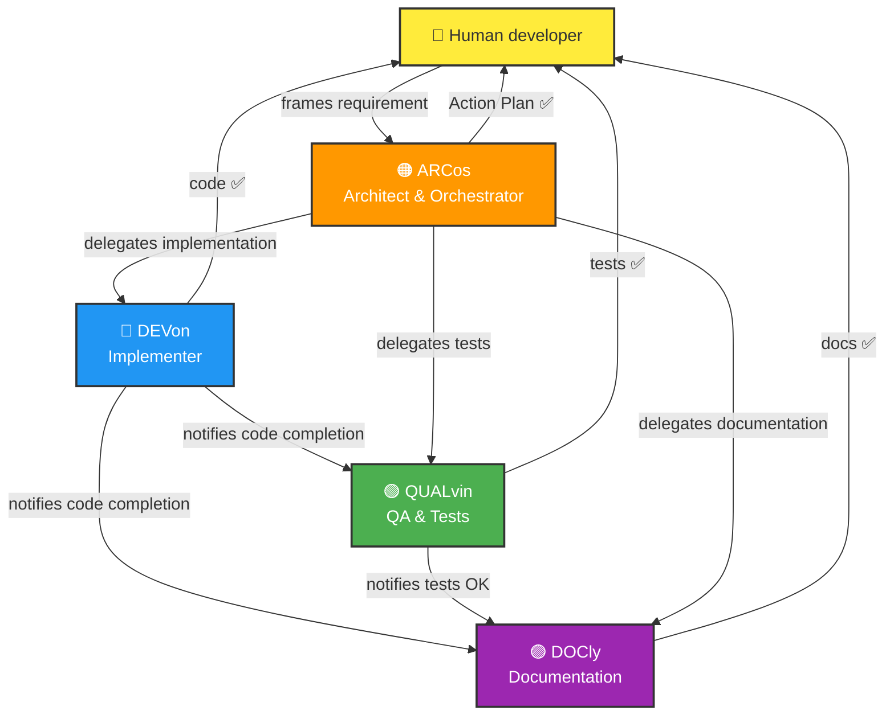

# 🤖 Copilot Templates & Agents Repository

This repository is a **cross-cutting reference hub** for reusable Copilot templates, instructions and prompts. It helps coordinate development with an **orchestrated multi-agent architecture**.

## 📚 Contents

### 🤖 Copilot Agents (.github/agents/)

Four specialised agents to orchestrate development:

- **Arcos.agent.md** — Technical planner and orchestrator (🟠 ARCos)
- **Devon.agent.md** — Production code implementer (🔵 DEVon)
- **Qalvin.agent.md** — QA and unit testing expert (🟢 QUALvin)
- **Docly.agent.md** — Documentation agent (🟣 DOCly)

All agents are **generic and ready to use** in any project.

### 📋 Templates (.github/)

- **copilot-instructions.template.md** — Generic template to initialise Copilot instructions in a new project (with placeholders)
- **copilot-instructions.md** — Copy of the template (generic baseline version)
- **instructions/** — 4 project-specific instruction templates (architect, dev, qa, doc) with placeholders to fill in
- **PLANS.md** — Full guide for creating and executing multi-phase Action Plans

### 🎯 Prompts (.github/prompts/)

Reusable prompts for recurring tasks:

- **init-copilot-instructions.prompt.md** — Initialise Copilot instructions in a new project
- **update-copilot-instructions.prompt.md** — Audit and update instructions from source code
- **migrate-to-template.prompt.md** — Migrate an existing project to these templates

### 📖 Examples (.github/examples/)

Practical examples for different project types:

- **copilot-instructions-domoticz.example.md** — Example: React Native / Expo project (archived for reference)

### 📖 Documentation

- **.github/README.md** — Guide to using templates, agents and prompts

---

## 🚀 Quick Start: Initialise a New Project

### 1. Copy the template

```bash
cp .github/copilot-instructions.template.md <votre_projet>/.github/copilot-instructions.md
cp -r .github/instructions <votre_projet>/.github/
```

### 2. Initialise automatically

Use the init-copilot-instructions prompt to generate the instructions:

```
👤 "Initialise les instructions Copilot pour ce projet"
```

The prompt will analyse your code and fill in the sections automatically.

### 3. Validate

Check that all placeholders have been replaced and that the project's conventions are properly documented.

---

## 🎯 Typical Workflow



To learn more, see `.github/PLANS.md`.

> 💡 **Parallelisation**: Use `/fleet` when several tasks (DEVon, QUALvin, DOCly) are independent so they can be executed simultaneously.

---

## 📚 Documentation

- **.github/README.md** — Complete user guide
- **.github/PLANS.md** — Action Plan guide
- **.github/agents/*.md** — Instructions for each agent
- **.github/instructions/*.md** — Project-specific instructions for each agent
- **.github/prompts/*.md** — Prompt documentation
- **.github/examples/** — Practical examples

---

## ✅ What You Will Find Here

✅ **Generic agents** — Ready to use in any project  
✅ **Templates** — Customisable for your context  
✅ **Agent instructions** — Project-specific templates for each agent (to customise)  
✅ **Prompts** — To automate initialisation and updates  
✅ **Complete documentation** — Usage guide and best practice  
✅ **Examples** — References for different project types  

---

## 🔄 Maintenance

The templates and prompts are **generic and versioned**. Each agent starts with a version (e.g. [v3.0]) to track changes.

| Agent | Version | Role |
|---|---|---|
| 🟠 ARCos | v3.2 | Architect & orchestrator |
| 🔵 DEVon | v3.1 | Implementer |
| 🟢 QUALvin | v3.1 | QA & tests |
| 🟣 DOCly | v3.1 | Documentation |

To update instructions in an existing project, use:
```
👤 "Complète les instructions Copilot depuis le code source"
```